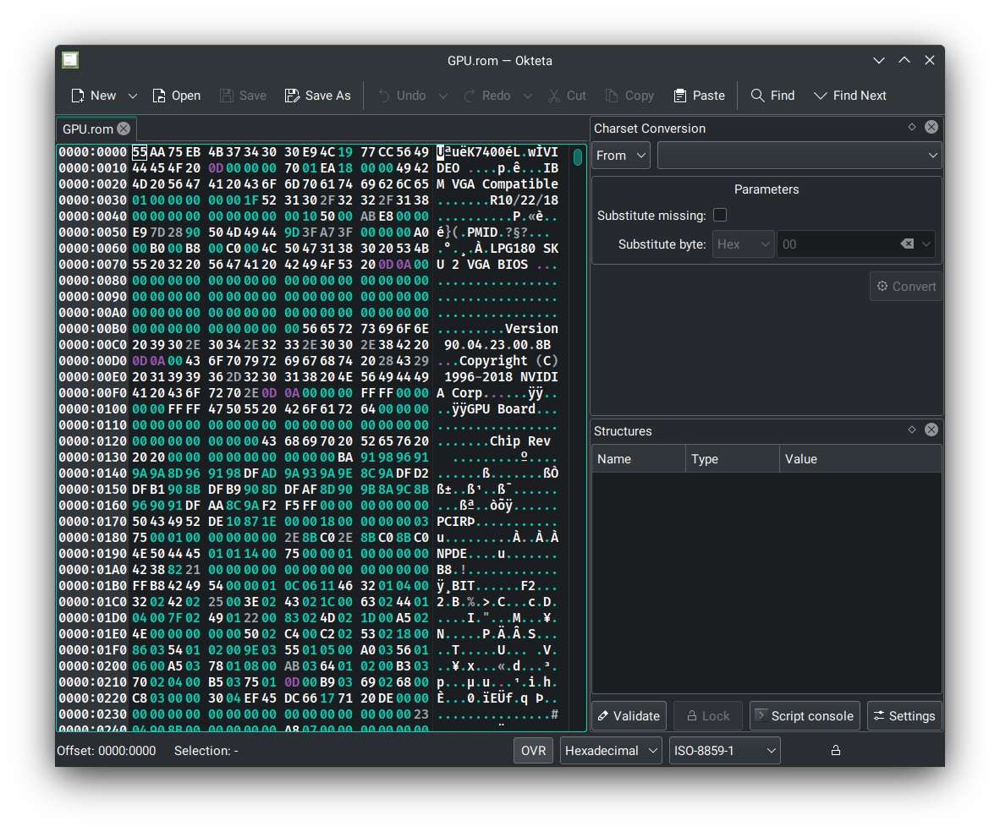
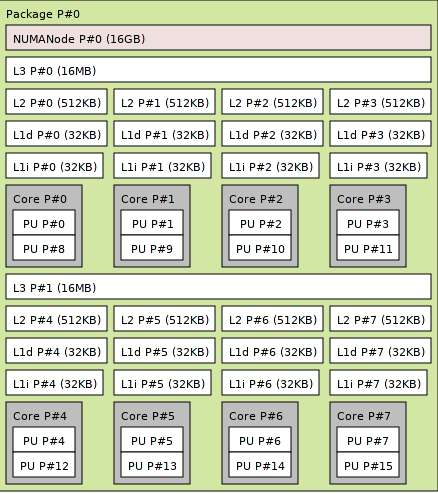

In early 2021, I transitioned my personal computers to Arch Linux and while the
experience has been excellent overall, there are a few shortcomings in the
software compatibility department, mainly with a few games (League of Legends)
and software I need to use for school (Multisim). While these can be "run" using
wine, I found that the experience left a lot to be desired, and for school
especially, I wanted to make sure I was in an environment supported by my
classes.
This led to the decision to use Windows for these as well as anything else not
supported well by linux. At this point you might be asking why I'm not just
dual-booting for simplicity. The main reasons are that I've gotten annoyed with
a lot of the telemetry, excess, and clunkiness of running Windows natively on my
desktop as well as for the sake of getting some experience with QEMU/KVM on
Linux. Note that this won't be a full guide to the process, but more of a
showcase on how I set it up for myself.

Feel free to use anything mentioned here for yourself and be sure to follow
along with the files mentioned by viewing them yourself on my
[github](https://github.com/knbu/virt-machine). Without further rambling, let's
get into the important parts.

## Table of Contents

## Hardware & Specifications

**CPU:** AMD Ryzen 7 3700x <br> **RAM:** 16GB DDR4 3600MHz <br> **GPU:** EVGA
RTX 2080 XC Gaming <br>

While most hardware choices don't really matter for this kind of virtualization,
eg. get as much memory as you can, have a processor with a lot of threads; one
recommendation I can make is to not get an Nvidia GPU. Not only is this good
advice for anyone looking to transition to a Linux desktop due to proprietary
drivers and other headaches, but it plays a large part in the complexity of this
setup as I painfully learned trying to figure out why the VM wouldn't start when
I first set it up, more on this later.

Other than that, my experience was pretty standard. Setting up a VM through
virt-manager and libvirt was the same process as any other type of VM. I
installed Windows normally using the default video drivers provided by QEMU and
virtio drivers for disks, network, etc, before doing anything GPU related to
make sure any errors I had to solve later weren't related to the VM itself.

## GPU Passthrough



Above is my edited vBios file that is passed through to the VM. Usually, when
you load into a graphical session, the vBios gets changed as you use the GPU.
Because of this, a new vBios is given to the VM to use. Next, to add the GPU
alongside any other devices such as a USB controller, I had to get the relevant
IOMMU groups. Here's an example of what the GPU group looked like on my system:

```sh
$ lspci -k

07:00.0 VGA compatible controller NVIDIA Corporation TU104 GeForce RTX 2080 Rev. A (rev al)
        Subsystem: eVga.com. Corp. Device 2182
        Kernel driver in use nvidia
07:00.1 Audio device NVIDIA Corporation TU104 HD Audio Controller (rev al)
        Subsystem: eVga.com. Corp. Device 2182
        Kernel driver in use snd_hda_intel
07:00.2 USB controller: NVIDIA Corporation TU104 USB 3.1 Host Controller (rev al)
        Subsystem: eVga.com. Corp. Device 2182
        Kernel driver in use xhci_hcd
07:00.3 Serial bus controller NVIDIA Corporation TU104 USB Type-C UCSI Controller (rev al)
        Subsystem: eVga.com. Corp. Device 2182
        Kernel driver in use nvidia-gpu

```

These were added to the xml file containing all the information for the VM.

Now that the normal setup is done, we can move on to specifics in a single GPU
setup. The idea is for this process is generally as follows:

1. Stop the host display server
2. Unload all GPU drivers
3. Load the vfio kernel modules in their place

This is accomplished with scripts that are triggered by the VM starting and
stopping. Naturally, start.sh handles startup, with the IOMMU groups sourced
from kvm.conf. Lucky for me, you only need to edit the vBios file on Nvidia
GPUs. Most documention said this was only required for pascal series (eg. GTX
1070), however, I was unable to get the VM to properly boot without this step.
Keep that in mind if you plan on having a similar setup.

## Optimization

Now that I had a working VM, the next goal was to reduce any latency and
overhead from virtualising Windows. Since I planned to play some competitive
games that don't run on linux, it was important to me to make it feel like I was
playing on bare metal. The main things I used for this were CPU Pinning and
HugePages
[(Arch Wiki)](https://wiki.archlinux.org/title/KVM#Enabling_huge_pages). CPU
pinning manually allocates certain threads to the VM so the host doesn't use
them as well, introducing latency. This is configured on a per-CPU basis since
every processor has it's own architechture. In my case, the Ryzen 7 3700x has
the following layout:



<br>

The important sections to look at are the grey boxes which represent a physical
core, and the group of grey boxes itself which represents a CCX (Core Complex).
I chose to only include cores from one of the two CCX present on the CPU. Since
the VM will only be used for gaming and schoolwork, 8 threads should be more
than enough performance. Using only one CCX will also improve latency since the
cores won't have to wait on information from the other CCX. Lastly, I chose the
second or bottom CCX since I want to leave Core #0 for the host. All of this can
be seen in the xml file, specifically in the "cputune" section.

The last major optimization I included was HugePages. Without going into too
much detail, it is an alternate way of providing memory to the VM, which results
in a massive difference in performance according to my testing. It is manually
allocated using the scripts triggered at startup and deallocated upon closing
the VM. I stronly recommend looking into HugePages if you decide to use a setup
like this. There were a few other small optimizations that I applied and you
might be able to find in the xml file, but they didn't provide enough of a
difference to be meaningful in my opinion.

## Hyper-V

Hyper-V is a virtualization platform on Windows, and it's normally used, in this
case, to hide the nature of the host to the guest machine. In other words, you
can use it to hide the fact that you are using a VM to circumvent some
anti-cheats and other software restrictions. I chose not to use it in my setup
due to the performance hit as well as not really needing it for anything I use
Windows for. Note that games like Valorant have been updated to automatically
flag Hyper-V users, but it can work for other titles with a similar anti-cheat.
